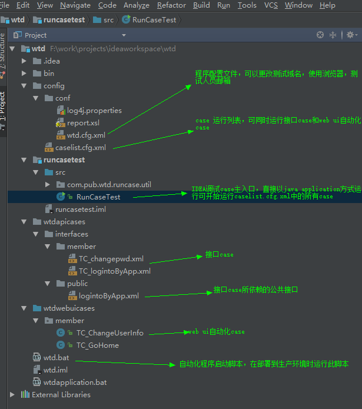
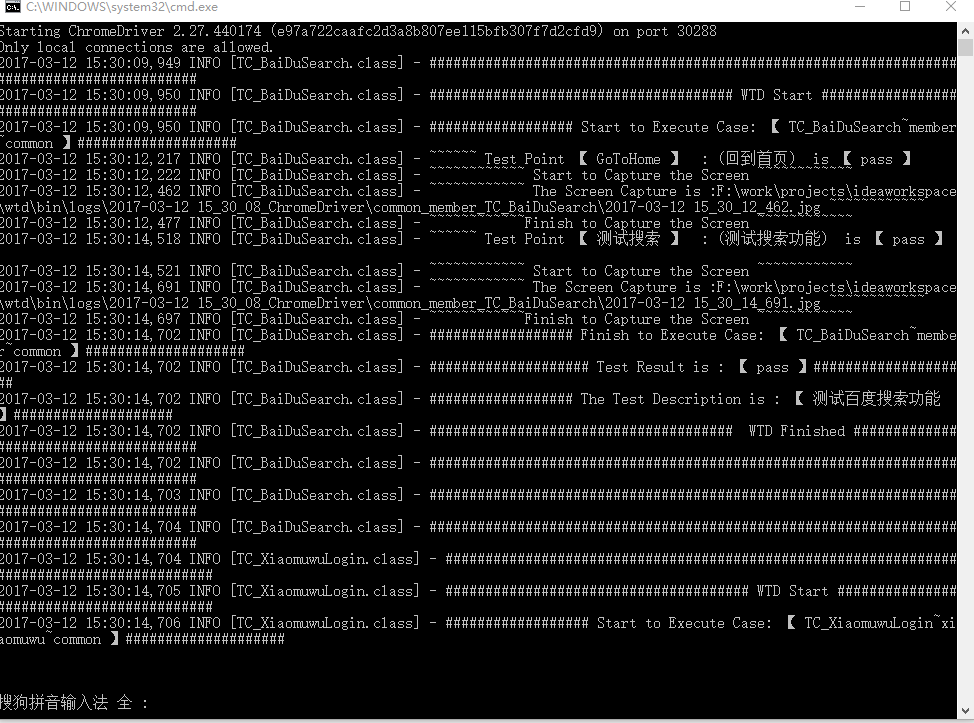
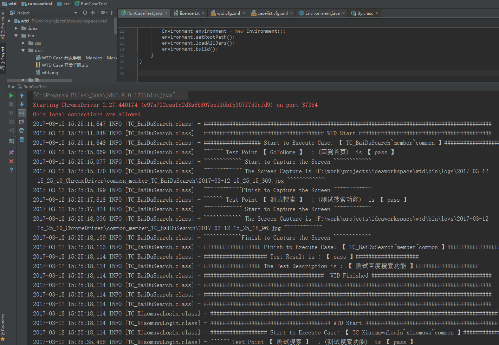
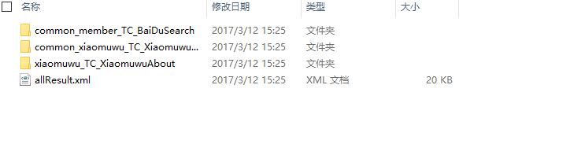
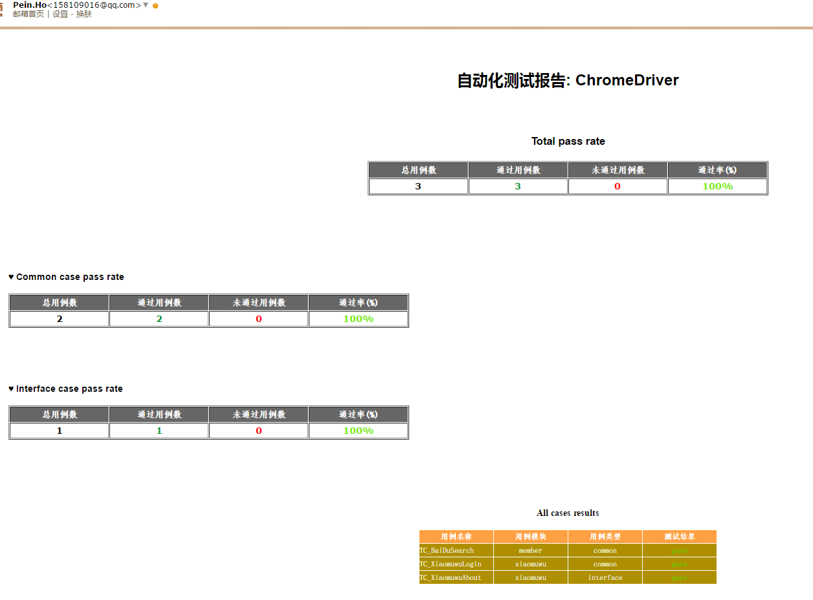

作者 何坤<3163172384@qq.com>, qq群：524212543 ， 个人博客：http://blog.jpmovie.cn

### 版本更新

v2.2    2018/01/20 
- 更新说明文件和democase

v2.1    2018/01/09 
- 更新最新chromewebdriver解决比较新的chrome打不开的情况

V2.0	2017/3/12
- 第一个版本
--------------

### 介绍
wtd自动化测试框架支持以下功能：
- 接口自动化测试，只需简单的一个接口的xml文件即可
- 网页UI自动化测试，编写一个简单的java文件放在wtd框架中即可执行
- 测试结果报告保存，测试结果和错误原因及网页截图文件会保存在本地
- 测试结果汇总并自动以邮件形式发送给相关测试人员
- 定时自动执行选定的测试case

wtd是基于selenium开发的，框架提供了很多通用的方法和接口，当然，开发的网页自动化case也可以直接使用webdriver的所有方法。接口测试case非常简单，只需要新建一个xml文件，里面替换掉接口地址，参数，期望返回结果等就可以了。对于需要登录的接口case也是支持的。

### 快速开始
##### 1. 环境准备并运行demo
- 下载wtd测试框架: git clone https://github.com/peintune/wtd.git 或者直接download
- 本地安装好JDK
- 本地安装[IDEA](https://www.jetbrains.com/idea/)开发环境。
- 打开IDEA，导入wtd整个项目
- 在IDEA开发环境中，直接运行 RunCaseTest类
###### 1.2 运行自己开发好的case
- 开发环境中运行：在IDEA开发环境中，更改caselist.cfg.xml文件，直接运行 RunCaseTest类
- 正式部署环境中运行，直接复制开发好的接口case(TC_xxx.xml)或者UI自动化case(TC_xxx.java)到正式测试环境中的对应目录中。更改caselist.cfg.xml文件，然后双击wtd.bat脚本启动。
- 正式部署环境定时循环任务：打开window终端运行  ./wtd.bat 2 5 3600,（2代表开始小时时间为2点，5代表循环执行5次，3600代表每次循环间隔为3600s）

以上，所有开发环境准备完成，可以开始写case了。

##### 2. 框架目录结构
- 所有的接口测试case都在wtdapicases/interfaces目录下，你可以根据需要自己在这个目录下建模块，比如member.注意public目录不存放case,但是可以保持公共接口。比如有50个接口case都需要依赖登录接口后才能测试，那么可以写一个登录接口放到public目录下，然后在50个case里面都调一下这个登录的接口。
- 所有的网页自动化case都在wtdwebuicases目录下。你可以根据需要自己在这个目录下建模块，比如member。这些case都是java文件。在部署到正式测试环境时不需要打包成jar或者编译成.class文件，只需要将源java文件放到对应正式测试环境，wtd会自动在执行的时候编译这个case的java文件的。
- wtd的配置文件是wtd.cfg.xml,里面可以配置UI自动化要启动的浏览器类型，比如chrome,firefox,safari。还有相关测试人员的邮件地址。
- 需要跑的case的列表信息在caselist.cfg.xml中。
- 在IDEA开发环境中，直接运行 RunCaseTest类即可，在正式测试环境中运行  wtd.bat脚本。


##### 3. 程序运行界面
3.1 正式测试环境程序运行界面

3.2 IDEA开发环境程序运行界面


##### 4.生成的log文件及截图


##### 5.自动生成的邮件报告


##### 6. 文档目录
- Case需存放的目录：	
- Case的形式：	
- Case的命名规范：
- Case的具体实现步骤：	
- Case可使用的变量及方法：
- 如何调试运行case：
- 如何部署环境：
- 一个Case实例：	

##### 7. Case需存放的目录：
- 在WTD项目中，将新功能性case新建在wtdwebuicases包中，并且此包要确定是一个sources root目录，默认导入的框架中的此目录已经是sources root目录。
- 将接口性case放入wtdapicases目录中。

##### 8. Case的形式：
- 功能性Case的实体是一个java文件。
- 接口性Case的实体是一个xml文件。

##### 9. Case的命名规范：
- Case开头已Tc_开头，如：Tc_LogIn。Tc是TestCase的缩写。

##### 10. Case的具体实现步骤：
-	ui 自动化 Case:
1.	在wtdwebuicases包中建立子package比如member,然后建立对应的case比如TC_BaiDuSearch.java。
2.	新建case类必须继承BaseCase类：public class TC_BaiDuSearch extends BaseCase{}
3.	Case必须实现无参方法execute()；在这个方法里做具体的事情。
4.	具体参考TC_BaiDuSearch  case模板。
-	接口测试 Case:
1.	在wtdapicases中新建TC_XiaomuwuAbout.xml文件，支持post,get,jsonrpc类型。
2.	写上接口case的测试地址。
3.	有需要可以设置全局变量为以后的case用。如：
 ```
<setGlobalVarible name="guid" value="$Cookie.guid"/>
 或者<setGlobalVarible name="sToken" value="$Response.sToken" />
 ```
4.	设置测试点（可以多个），其中包括期望返回值（可正则表达式），执行测试点之前可执行其他公共接口。改测试点的各个参数。如：
	```
	<test name="the correct values"  expectContansString='iStatus":1' preExcution="loginByApp">
	<parameter name="userId" value="1800012315" />
	</test>
	<test name="the wrong values"  expectContansString='iStatus":0'">
	<parameter name="userId" value="1800012111" />
	</test>
    ```
5.  接口Case可以自定义全局变量，也可以用系统的中变量。系统中的变量包括:
  ```
  $Cookie,$Response,$PreResponse
  ```


##### 11. UI 自动化测试case可使用的变量及方法：
-	SessionData 类：

| 变量名      | 描述         |
| ------------- |-------------|
|webDriver	|Webdriver 的一个实例，用于case进行页面各种操作的一个对象，可以直接在case中调用如，webDriver.get();|
|hostName	|当前测试的主要的host name, 可以直接在case中调用|
|caseName	|当前测试的case 名字, 可以直接在case中调用|
|logFolder	|当前case生成log和result文件的目录, 可以直接在case中调用|
|logger	|可以用来记录log到log文件, 可以直接在case中调用|
|isOnlineTest	|判断当前环境是否为线上测试环境|
- 	screenCapture()方法：返回类型：String
调用此方法会截一张当前的图片保存到当前case 的log文件夹里。
-	setDescription(String)方法: 返回类型：void
调用此方法会为当前case设置描述信息。
-	setErrorInfo(String)方法：返回类型：void
调用此方法会为当前case设置一些错误的log信息，便于在log文件中查看错误原因。
-	setPointResult(String name,String description,String result,String errorInfo)方法：返回类型：void
调用此方法会将每个测试点的结果写进result.xml和log文件中。注意：测试点是包含在每个case中的，每个case至少包含一个测试点，也就是说每个case至少调用此方法一次。

-	clickBy (By by)方法:返回类型：boolean
调用此方法会点击页面一个控件，并返回是否执行成功。
-	clickById(String id)方法：返回类型：boolean
调用此方法会点击页面一个控件，并返回是否执行成功。
-	clickByLinkText(String link)方法:返回类型：boolean
调用此方法会点击页面一个控件，并返回是否执行成功。
-	sendKeys(By by, String value)方法：返回类型：boolean
调用此方法会向一个控件输入信息，并返回是否执行成功。

-	sendKeysById(String id, String value)方法：返回类型：boolean
调用此方法会向一个控件输入信息，并返回是否执行成功。
-	isExist(By by)方法:返回类型：boolean
调用此方法会判断某个元素是否存在，并返回判断结果，true是找到该元素。
-	isTextExist(String content)方法:返回类型：boolean
调用此方法会判断是否存在某个值的元素，并返回判断结果，true是找到该元素。比如判断当前页面是否有“注册”字段。

-	isCurrentURL(String url)方法：返回类型：boolean
调用此方法会判断当前URL是否和传入的URL一样，并返回判断结果，true是表示一样的。

>	更多方法可以参考com.pub.wtd.common.BaseCase 类和webdiver对象中的方法。或者登陆 [小木屋](http://snappydata.top)

##### 12. 如何调试运行case：
1.	调试运行case：
2.	在Intellij IDEA 中打开整个WTD项目。
3.	编写接口测试case和ui 自动化测试case，具体可以参考项目中的demo。
4.	更改config/conf/wtd.cfg.xml中测试的hostname，测试浏览器，测试人员邮箱的信息。
5.	在conig/caselist.cfg.xml中添加要调试运行的case。
6.	运行或者调试运行runcasestest 包中的RunCaseTest类。 
##### 13. 如何部署环境：
1.	更改config/conf/wtd.cfg.xml中测试的hostname，测试浏览器，测试人员邮箱的信息。
2.	在conig/caselist.cfg.xml中添加要测试的case。
3.	双击运行wtd.bat或者通过任意windows shell环境运行wtd.bat(推荐)。

##### 14. 一个接口 Case实例：
```xml
<?xml version="1.0" encoding="utf-8" ?>
<case description="change the userlogin passwd" type="post">
    <testApi api="http://xxx.xxx.qa.ipo.com/api/internal/user/changepwd.html" />
     <setGlobalVarible name="guid" value="$Cookie.guid"/>
      <setGlobalVarible name="token" value="$Response.token"/>
	<test name="the correct values"  expectContansString='iStatus":1' preExcution="logintoManage">
		<parameter name="iUserID" value="$PreResponse.istatus" />
		<parameter name="sOldPassword" value="a592ee46b591ba0c8bcce6a27c109f65" />
		<parameter name="sNewPassword" value="4e1cea91bcd58ab5982ab1b50c2a782b" />
	</test>	
	<test name="the correct values"  expectContansString='iStatus":1'>
		<parameter name="iUserID" value="45671" />
		<parameter name="sOldPassword" value="4e1cea91bcd58ab5982ab1b50c2a782b" />
		<parameter name="sNewPassword" value="a592ee46b591ba0c8bcce6a27c109f65" />
	</test>	
</case>                  
```
##### 15. 一个UI自动化 Case实例：

```java
public class TC_BaiDuSearch extends BaseCase {
   /**
    * 每一个ui自动化case都必须实现execute（）方法，此方法是此case的入口。
    * 编写case时可以参考以下步骤：
    * 1，打开首页或者一个链接或者自己定义的一个页面:webDriver.get(String),new HomePage(sessionData).goToPage(),
    * 2，设置这个case的描述信息:setDescription(String)
    * 3，执行某些操作。
    * 4，检查预期值或者页面元素并设置这个测试点测试通过或者测试失败:setPointResult("", "", "pass", "NULL");
    * 5，有必要时可以截取当前页面的截屏:screenCapture()
    *
    * 对于第三步，目前支持以下操作。
    * 1，查找页面元素：findElement(By),findElementById(String),findElements(By).
    * 2，查找元素的值（也就是元素的value）,findElvalue(By)
    * 3，点击页面元素：clickBy(By),clickById(String),clickByLinkText(String)
    * 4，判断页面元素是否存在：isExist(By)
    * 5，判断文本是否存在:isTextExist(String)
    * 6，向诸如文本框之类的控件输入值：sendKeysBy(By,String),sendKeysById(By,String)
    * 7，所有webdriver支持的操作。
    *
    * 更多更新信息请到 snappydata.top
    */
   public void execute() {
      //new HomePage(sessionData).goToPage();// 自定义一个页面，所有case都可以共享这个页面,直接在case中打开这个页面。

      webDriver.get("http://www.baidu.com");//利用webdriver执行打开页面

      setDescription("测试百度搜索功能");// 设置case的描述信息
      
      if (isCurrentURL(hostName+"/")|| isCurrentURL(hostName )) {// 判断当前页面是否是百度主页

         setPointResult("GoToHome", "回到首页", "pass", "NULL");//设置此测试点通过
      } else {
         setPointResult("GoToHome", "回到首页", "fail","can not go to home page");//设置此测试点失败
      }


      String path = screenCapture();// 截取当前页面截屏

      testSearch();//测试搜索功能

   }


   public void testSearch(){
      sendKeysById("kw","snappydata.top");
      clickById("su");
      if(isTextExist("snappydata")){
         setPointResult("测试搜索","测试搜索功能","pass","NULL");
      }else{
         setPointResult("测试搜索","测试搜索功能","fail","百度搜索测试失败");
         screenCapture();// 截取当前页面截屏
      }

   }
}
```
精品电影网：http://www.jpmovie.cn
